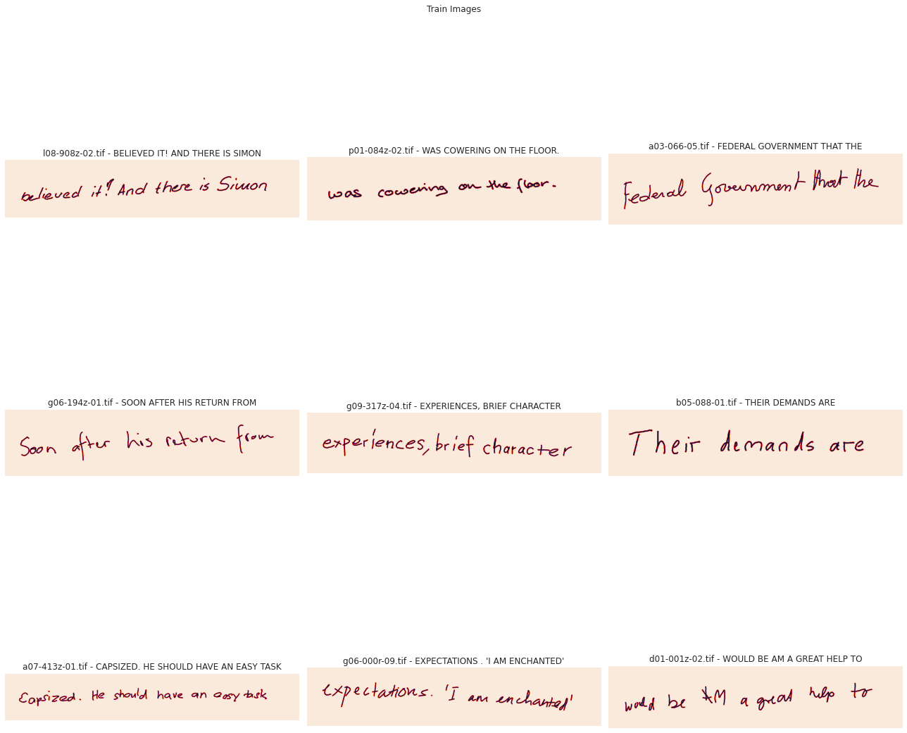
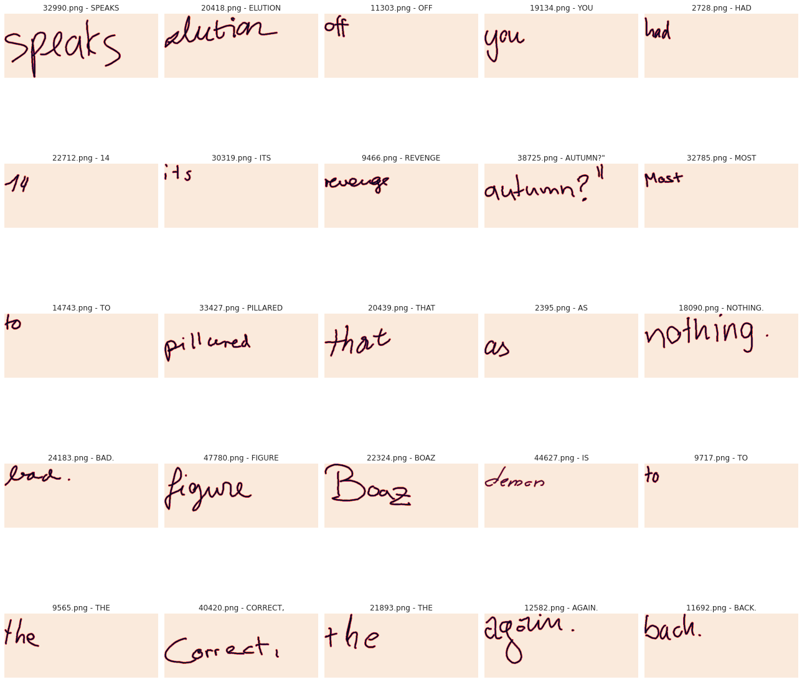
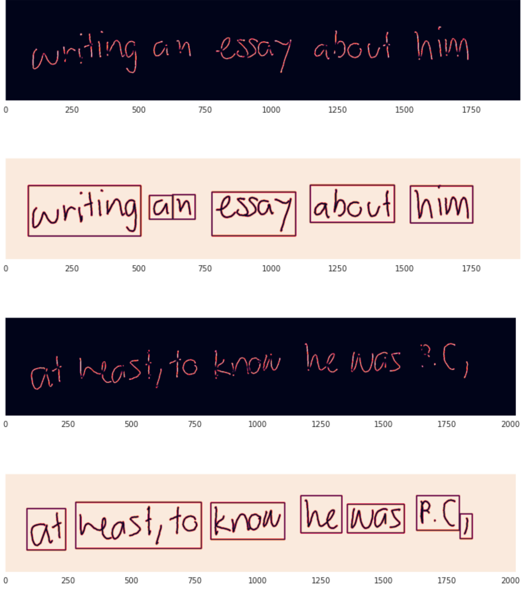
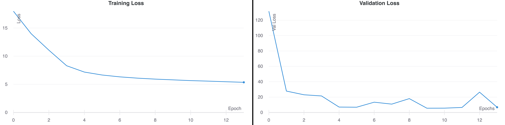
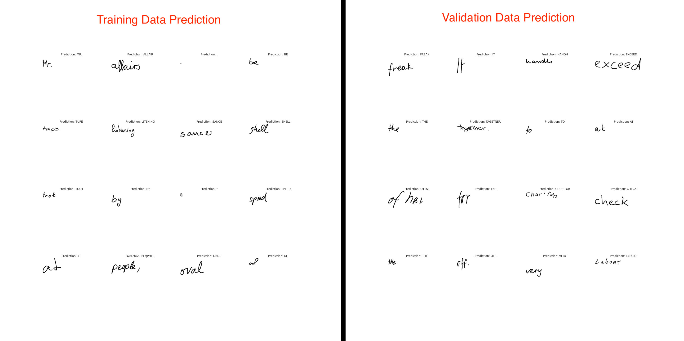
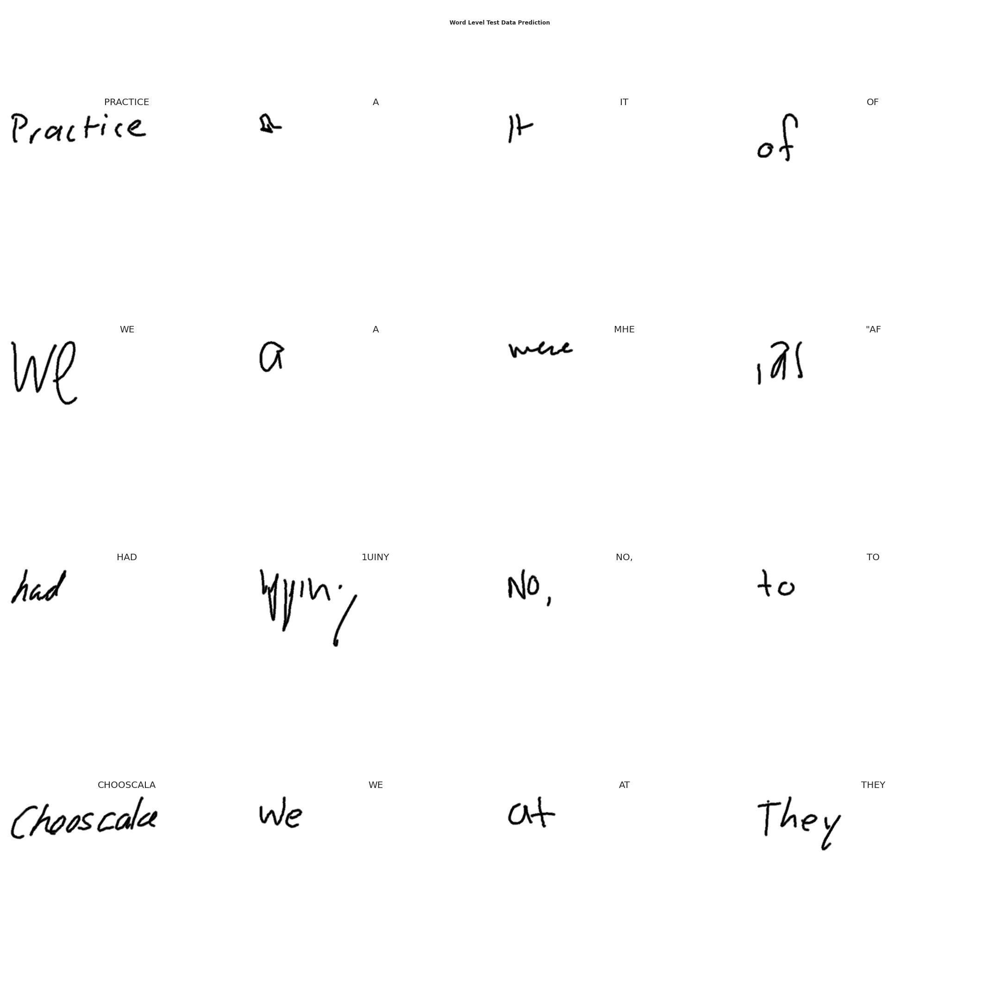
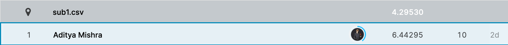
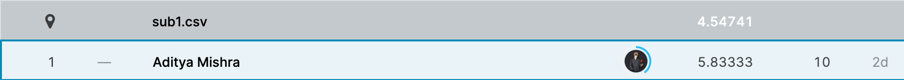

# Case Independent Handwritten Line Recognition

## Description
The goal of the competition is to create a model that correctly recognizes the handwritten text line present in the image.

## Evaluation
Evaluation Metric will be the Average Levenshtein Distance between the predictions and the ground truth.

## Raw Data
The data consists of images in "tif" format. Each image has a ground truth text file with the same name. For example, If the image is 1.tif the ground truth file would be 1.gt.txt

The images contain a line written in the english language and the length of the sentence or no. of words can vary. The text values are all in upper case and can also contain special characters.

Data Available Here - https://www.kaggle.com/c/arya-hw-lines/data



## Data Processing
### Train Data
Sentence level data is converted into word level data. Refer - [Create Word-Level Data Notebook](notebooks/create_word_level_data.ipynb).

* [Word Level Train Data - 250x600](https://www.kaggle.com/aditya08/ocr-crnn-train-word-split-250-600)
* [Word Level Train Data - 300x600](https://www.kaggle.com/aditya08/ocr-crnn-train-word-split-300-600)


### Test Data
Since labels are not available for test data, we cannot use the above technique. So for test data we utilise opencv techniques to create splits. Code taken from [stackoverflow post](https://stackoverflow.com/questions/37771263/detect-text-area-in-an-image-using-python-and-opencv). Check out [this notebook](notebooks/handwritten-ocr-crnn-v1-inference-part-1.ipynb) to know more


* [Word Level Test Data - 250x600](https://www.kaggle.com/aditya08/ocr-crnn-test-word-split-250-600)
* [Word Level Test Data - 300x600](https://www.kaggle.com/aditya08/ocr-crnn-test-word-split-300-600)


## CRNN
CRNN model consists of CNN & RNN blocks along with a Transcription Layer.
* CNN Block - Three convolution blocks (7 conv layers) & maxpool layer. Extracts features from image.
* RNN Block - Two Bidirectional LSTM layers. Splits features into some feature sequences & pass it to recurrent layers
* Transcription Layer - Conversion of Feature-specific predictions to Label using CTC. CTC loss is specially designed to optimize both the *length* of the predicted sequence and the *classes* of the predicted sequence

In CRNN convolution feature maps are transformed into a sequence of feature vectors. It is then fed to LSTM/GRU which produces a probability distribution for each feature vector and each label. For example, consider the output of CNN Block is - `(batch_size, 64, 4, 32)` where dimensions are `(batch_size, channels, height, width)`. Then we need to permute dimensions to `(batch_size, width, height, channels)` so that channels is the last one.

> Each feature vector of a feature sequence is generated from left to right on the feature maps by column. This means the i-th feature vector is the concatenation of the i-th columns of all the maps.

It is then reshaped to `(batch_size, 32, 256)` and fed into the GRU layers. GRU produces tensor of shape `(batch_size, 32, 256)` which is passed through fully-connected layer and log_softmax function to return tensor of the shape `(batch_size, 32, vocabulary)`. **This tensor for each image in the batch contains probabilities of each label for each input feature.**


## Training
Trains a CRNN model at the word level. Saves the best model based on validation loss. Supports **Greedy** & **Beam Search** Decoding. Reports the following metrics on both training & validation data -
1. Accuracy
2. Mean Levenshtein Distance
3. Character Error Rate

The data is divided into 3 sections - Train (70%), Valid (15%) & Test (15%). The training script trains model on the train split (`train` method) & evaluates model on all the 3 splits (`infer_all` method).

### Running it locally
1. Download the training data from above & extract it inside `data/train` directory. Some sample data is available already
2. Run the training script. You can modify the hyperparameters inside the `config.py`.
```bash
poetry run python train.py
```

## Evaluation
Download the test data from above & extract it inside `data/test` directory. To generate submission run the evaluation script.
```bash
poetry run python eval.py
```
Supports *Greedy* as well *Beam Search Decoding* based on choice. Set `greedy=False` in `make_submission` function for BeamSearch Decoding.

## Result
I ran multiple experiments with varying degrees of image size, model depth, number of epoch, etc. The following configuration worked the best -

* BATCH_SIZE - 16
* EPOCHS - 20
* IMG_HEIGHT - 250
* IMG_WIDTH - 600
* MAX_LENGTH - 10

### Word Level - Training & Validation Loss


### Word Level - Training & Validation Data Prediction


### Test Data Prediction


### Other Metrics
| Metric | Training | Validation |
--- | --- | ---
|Accuracy|0.5474|0.5382|
|Levenhstein Distance|0.8808|0.9122|

### Kaggle LeaderBoard
*Public LeaderBoard*


*Private LeaderBoard*


## Next Steps
1. Train Deeper Model
2. Add Spatial Transformer Network Component
3. Centering the image somehow didn't work

## TensorFlow Serving

Production ready model serving
* Part of TF Extended (TFX) Ecosystem
* Internally used at Google
* Highly scalable model serving solution
* Works well for models upto 2GB (sufficient for most cases)

> TF-Serving is not available for Windows or macOS. So, the only option is to use Docker
### Pulling Server Image
```bash
docker pull tensorflow/serving
```

### Running a serving image
The serving images (both CPU and GPU) have the following properties:

* Port 8500 exposed for gRPC
* Port 8501 exposed for the REST API
* `MODEL_NAME` env variable set to "handwritten_ocr". Defaults to "model"

### Serving with Docker
Inside the root directory.
```bash
docker run -d --name tfserving -p 8501:8501 \
  -v "$PWD/saved_model:/models/handwritten_ocr" \
  -e MODEL_NAME=handwritten_ocr -t tensorflow/serving
```
* `-d` - Runs in daemon mode
* `-p 8501:8501` - Maps port 8501 on host to container
* `--name tfserving`  - Name of the container
* `--mount` - Bind mounts the local folder on to the container. Allows accessing the saved model from within the container
* `-e` - Sets environment variable. Sets `MODEL_NAME` to "handwritten_ocr". This will form the part of URL endpoint
* `-t` - Docker image to use (tensorflow/serving here)

### REST
Tensorflow serving provides REST endpoint
* Standard HTTP Post requests
* Response is a JSON Body with the prediction
* Request from the default or specific model

Default URL structure - `http://localhost:8501/v1/models/{MODEL_NAME}`

A sample script which reads data from [Streamlit Drawable Canvas](https://github.com/andfanilo/streamlit-drawable-canvas) and sends it as a HTTP Post request to the deployed model -

```python
import streamlit as st
import streamlit_drawable_canvas as st_canvas

# Code to add drawable canvas. Refer link above
canvas_result = st_canvas(...)

# Read data
img = canvas_result.image_data

# Do something with the data
...

# Prepare headers & data to be sent in the POST request
json_data = json.dumps({"instances": img.tolist()})
headers = {"content-type": "application/json"}
# Send the request to the Prediction API
response = requests.post(endpoint, data=json_data, headers=headers)

# Decode the prediction
prediction = magic_decode_recipe(response.json()["predictions"])
print(f"Prediction: {prediction}")
```

### Multilple Versions
Here, I am serving multiple models. Create a `models.config` file with the following content -

```bash
model_config_list: {
    config: {
        name: "handwritten_ocr",
        base_path: "/models/handwritten_ocr/",
        model_platform: "tensorflow",
        model_version_policy: {specific: {versions: 1, versions: 2}}
    }
}
```
Then pass this filepath as an argument when creating docker container -

```bash
docker run -d --name tfserving -p 8501:8501 \
  -v "$PWD/saved_model:/models/handwritten_ocr" \
  -v "$PWD/models.config:/models/models.config" \
  -e MODEL_NAME=handwritten_ocr -t tensorflow/serving --model_config_file=/models/models.config
```

* HealtCheck URL - http://localhost:8501/v1/models/handwritten_ocr/versions/<version_number>
* Prediction URL - http://localhost:8501/v1/models/handwritten_ocr/versions/<version_number>:predict